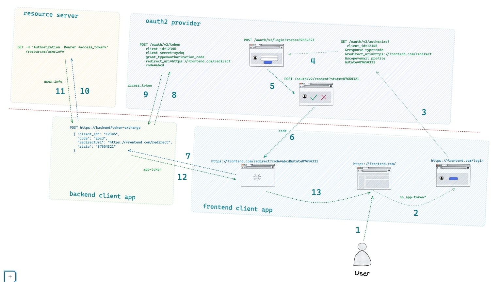

# Oauth2 protocol (Authorization Code Flow)

## What is Oauth?
The Oauth2 protocol aims to let a user to log in to a certain application using the credentials of another application which is the **Oauth2 provider**.
The client application to which the user gets logged in, can take advantage of some of the user data fetched by the **Resource Server** which is the server containing the user information, that is often the same entity of the Oauth2 provider itself.

So Oauth2 provider aims to check the user credentials and to guide the authorization flow from the beginning to the end, instead the Resource Server is the server to which query the user information via the obtained `access_token`.

## How many different Oauth2 flow exist?
These are the most common OAuth 2.0 flows, along with their possible synonyms used in the industry:

- `Authorization Code Flow` (aka `Web Server Flow` or `Server-side Flow`): This flow is used when the client (usually a web server) is requesting access to a protected resource on behalf of a user. The flow involves the client first redirecting the user to the authorization server, where the user is prompted to log in and grant permission to the client. The authorization server then redirects the user back to the client with an authorization code, which the client can exchange for an access token.

- `Implicit Flow` (aka `Client-side Flow`): This flow is similar to the authorization code flow, but is used when the client is a web application running in the user's browser. The flow skips the step of requesting an authorization code and instead immediately returns an access token to the client.

- `Resource Owner Password Credentials Flow` (aka `Password Flow`): This flow is used when the client already has the user's username and password, and wants to directly exchange those credentials for an access token.

- `Client Credentials Flow`: This flow is used when the client (often a service or backend application) is requesting access to protected resources on its own behalf, rather than on behalf of a user. The client simply presents its own credentials to the authorization server in exchange for an access token.

- `Device Authorization Flow` (aka `Device Flow`): This flow is used when the client is an input-constrained device (such as a TV or game console) that cannot display a full user interface for logging in and granting permission. The flow involves the device presenting a user code to the user, who then visits a web page on a separate device to enter the code and grant permission to the client.

## How an application can take advantage of the Oauth2 protocol?

An application can avoid having its own user database to have some user data, avoiding the user to signup to its system, fill a form of personal data and remember the relative credentials.

To let an application use Oauth2, it must be first registered to an Oauth2 provider by specifying some data like the `redirect_uri` and some other application details. 

The `redirect_uri` is provided by the application developer to the Oauth2 server while filling the form for the registration phase. This URI belongs to the application and will be user by the Oauth2 provider to force a redirect to the user's browser at half of the login process.
This important parameter will be saved in the Oauth2 database and, when sent to it by the user's browser, it will be recognized as part of the mandatory parameters. 

When the application is registered inside the Oauth2 provider's database, a `client_id` and `client_secret` are provided to the application developer.

These two parameters are also used during the login phase because sent back to the Oauth2 provider in different phases of the login flow. The `client_id` is sent at the first call (normally by the frontend application), the `client_secret` (often even optional) is sent back at a successive phase by the application (normally by the backend of the application).

This flow, called **Authorization Code Flow** is the most complete and secure because involves two steps: the acquisition of an `authorization code` which is a temporary code got from the Oauth2 provider by providing email and password and a second step consisting of the exchange of this temporary code with an `access_token` got from the Oauth2 provider to fetch the user information (from the Resource Server) according to the requested `scope` (which is another parameter sent in the requests).

One other optional parameter which, when not set by the client in the first call it's generated by the Oauth2 provider) is the `state`, a random string which will chain all the requests together as a sort of sessionID for the entire login flow.

Often, the documentation on Oauth2 Authorization Code Flow enlight only the 2 steps consisting in the GET call to the `/authorize` endpoint to finally get the temporary `authorization code` and the second call, a POST to `/token` (often performed by a backend of the client application) to exchange the `authorization code` with the `access_token`.

No other steps are often mentioned because they don't require specific actions for the client application, whose only actions are recognized to be the previous two steps.

From the Oauth2 provider perspective, in reality, there will be other steps to be managed, such as the rendering of the login page for the provider itself and the consent page.

## Oauth2 protocol example

### `Oauth-server` project
In the provided example we have the `oauth-server` project containing the Oauth2 provider and Resource Server in the same process and exposing all the necessary endpoints to perform the entire Oauth2 login flow according to the Authorization Code Flow standard. 

The project respect the standards but fakes the database of users, sessions, tokens for the sake of simplicity.
This project provides both pure REST endpoints with JSON requests/responses and also some HTML interfaces to let the user interact by inserting email and password and by consenting the access to their profile.

It creates an `access_token` in the form of a jwt by using some of the user data as claims. The protocol doesn't specify if the `access_token` must be in the form of a jwt or a simple string. The advantages of a jwt over a simple string are:
- it has some user info specified in its body so you don't have to query the database to get more user information;
- it has a valididity specified, so you don't have to take care of an expiration date apart from it;
- you can avoid saving it into a database (unless you want to have a mechanism to invalidate the token before its expiration date), because you don't need to link this string to a user or to some user grants or to an expiration data because all those pieces of information are already present in the body of the token itself.

The `access_token` is used by the client application (at the end of the Oauth2 flow) to fetch the user information.
It **should not be used** by the client application to authorize the calls between frontend and backend and among the backend components (in case of microservices) because the `access_token` has nothing to do with the client application.

### `Oauth-client` project
This project implements the Oauth2 client application. In this example we suppose the client application to have been already registered (by the application developer) to the Oauth2 provider by filling a form (which it's not provided in this example).

So the Oauth2 provider knows the client application, has already assigned a unique `client_id` and a `client_secret` to be used by the client application in the flow, and knows the `redirect_uri` indicated by the application developer to be the URI (belonging to the client application frontend) to which the Oauth2 provider must force the user's browser to perform a redirect at half of the flow.

In this example, we provide a client (and registered) application composed of two part: frontend and backend.

The frontend starts the login flow if the `app-token` is not found in the local storage of the browser.

The `app-token` is the token used by the client application to authorize the calls between frontend and backend, so it's different from the `access_token`.

The frontend performs the first steps, until the `authorization code` is returned by the Oauth2 provider, then the `redirect_uri` is fetched by the browser after a 302 HTTP status is sent back by the Oauth2 provider.
This redirect let the frontend application contact the backend client application to continue the second part of the flow, consisting in exchanging the `authorization code` with the `access_token` and from this point, the third enpoint (belonging to the Resource Server) can be hit to fetch the user information according to the `scope` specified for the flow.

## The various steps of the Authorization Code Flow in the example

When the `app-token` is not found in the browser, the javascript of the frontend application redirects to the "Login with WalrusMail" page. The action associated to this button performs a GET request to the Oauth2 provider with all the required information chained as query parameters, such as `client_id`, `scope`, `redirect_uri`, and the optional `state`.

By receiving this call, the Oauth2 provider starts the Oauth2 flow by saving in its database the details. if the `state` is not provided, the Oauth2 provider generates one and uses it as a sessionID to chain all the steps of the flow together.

After having started the flow, the Oauth2 provider renders a login page to the user, with the email and password fields. This form has the `scope` as hidden field to let the Oauth2 provider recognize that those provided credentials belong to a specific started login flow in particular.

When the Oauth2 provider gets the credentials check the Resource Server's database to see if the user exists and, in case of success, renders a "Consent" page to allow the user explicitly understand and approve the `scope` of the login, which means what application wants to access and to what of their resources from the Resource Server (for example: email, profile detail, profile picture, contacts, etc.)
Even in the consent page, before rendering, the Oauth2 provider has placed the `state` as an hidden parameter to let the various steps to be chained to the same login attempt for a specific `scope`.

After the consent is formally obtained by the Oauth2 provider, the `authorization code` is created and saved in the Oauth2 database for that specific login attempt and an HTTP status 302 is returned to the user browser towards the `redirect_uri` with the fresh generated `code` and the `state` as query parameters.

The `redirect_uri` belongs to the frontend client application, so from now it's again the client application responsibility how to organise the subsequent steps.

In the provided example, we followed a standard way to proceed: the `redirect_uri` page has some javascript action to call the backend of the client application by sending the `code` and other details, such as the `client_ID`.

The backend receives the data and uses the obtained `code` to send another request to the `/token` endpoint of the Oauth2 provider in order to exchange the `code` (along with `client_id` and `client_secret`) with the `access_token`.

The Oauth2 provider receives the payload of information as a form of encoded data via HTTP POST method and checks in its database the presence of that temporary `code` for that login attempt.

If a corrispondence is found an `access_token` is generated. In this example the `access_token` is a jwt generated with some of the user data, so the Oauth2 provider queries the Resource Server (they are the same entity so it just queries its database) to get the user information needed to fill the `claims` of the jwt. 

The provided jwt expires in 1 hour and it's returned to the client backend application as an HTTP Header in the response and also as a JSON payload in the body response. 
These two ways of returning the `access_token` have been choosen because normally the `access_token` is returned OR as an header OR in the response body.

When the client backend application gets the `access_token` performs a call to the Resource Server (to the `/userinfo` or `/me` endpoint) this directly after the previous call BEFORE responding to the client frontend application (to the request in which it has sent the `code`). 
The user info call is authorized through the `access_token` so the header that is passed is the following:
```
-H "Authorization: Bearer <access_token>"
```

The Resource Server returns the user information in a way that respect the initial requested `scope` and the client backend application has now knowledge of the user and has a bunch of information useful for the specific application needs.

The backend client application can now create its own token (that in this example we have called `app-token` to distinguish from the generic `token` or `access_token` of the Oauth2 protocol) as a simple string, as a jwt or as a session cookie to be sent back to the frontend client application.

## How to run the example

To run the example you can do the following:
```bash
# on the first tab
cd oauth-server
go run main.go

# on the second tab
cd ../oauth-client/frontend
go run main.go

# on the third tab
cd ../backend
go run main.go
```

Then visit the browser and go to `http://localhost:8081`
If you open the Chrome developer options with `Inspect > Application > LocalStorage > http://localhost:8081` you'll see no `app-token` is found so you'll be redirected to the `Login with WalrusMail` page.

If you click on it, you'll be redirected to a login form. Insert the following credentials:
```
Email: john.doe@email.com
Password: jjj
```
Then click to `Consent` button after the Consent page is shown.

Under the hood, the `authorization code` is producted, the `http://localhost:8081/redirect?code=<code>&state=<state>` page is redirected to the browser, this page immediately contacts the client backend application to exchange the `code`. The backend contacts the Oauth2 server to exchange the `code` with the `access_token`.

Immediately, the backend uses the `access_token` to fetch the `userinfo` from the Resource Server and generates the `app-token` let's say from this `userinfo`. The `app-token` is returned to the frontend application as a response header and, from this one, is saved in the localstorage of the browser before performing a redirect to the welcome page.

To retry the flow, after the token is saved, you must access the localstorage of your browser and delete the `app-token` by doing:
`Inspect > Application > Storage > Clear Site Data`

## Schema


